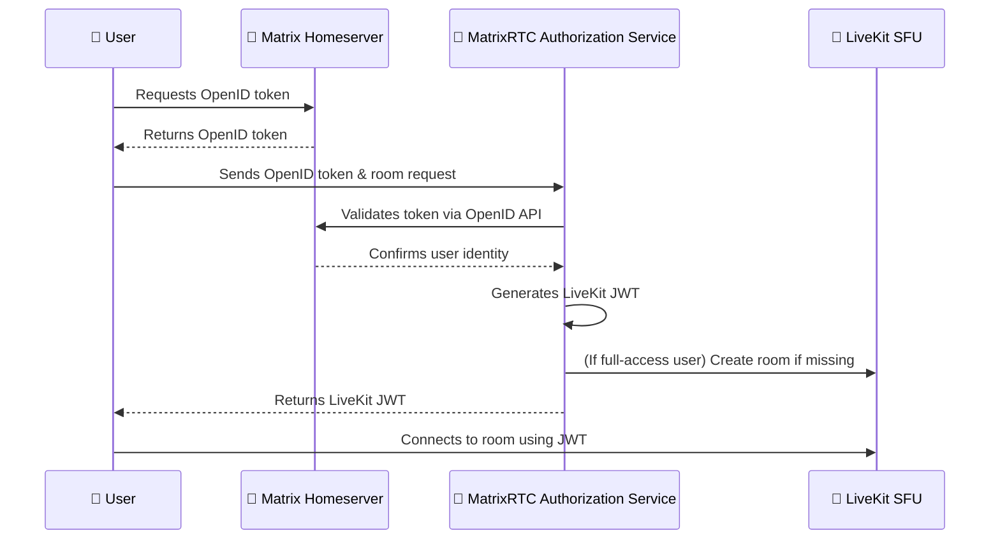

# 🎥 MatrixRTC Authorization Service

The **MatrixRTC Authorization Service** bridges Matrix and LiveKit, handling
authentication and room creation when needed.

## 💡 TL;DR

Matrix user wants to start or join a call?

👤 ➡️ Gets OpenID token ➡️ Sends it to the **MatrixRTC Authorization Service** ➡️
Receives LiveKit JWT ➡️

- **If full-access user** ➡️ Can trigger LiveKit room creation (if needed) ➡️
  Joins the call 🎉
- **If restricted user** ➡️ Can join existing rooms ➡️ Joins the call 🎉

📡 Once connected, the LiveKit SFU handles all real-time media routing so
participants can see and hear each other.

## 🏗️ MatrixRTC Stack: Architecture Overview

<p align="center">
  
</p>

## 📌 When to Use

This service is part of the **MatrixRTC stack** and is primarily used when the
[LiveKit RTC backend (MSC4195)](https://github.com/matrix-org/matrix-spec-proposals/pull/4195)
is in use.

As outlined in the
[Element Call Self-Hosting Guide](https://github.com/element-hq/element-call/blob/livekit/docs/self-hosting.md),
you’ll also need:

- A [LiveKit SFU](https://github.com/livekit/livekit)
- MatrixRTC-compatible clients such as
  [Element Call](https://github.com/element-hq/element-call), which can run
  either:
  - As a standalone Single Page Application (SPA) or
  - Embedded for in-app calling

## ✨ What It Does

🔑 **Generates JWT tokens** for a given LiveKit identity and room derived from
the Matrix user and Matrix room, allowing users to authenticate with the LiveKit
SFU.

🛡️ **Manages user access levels** to ensure the proper and secure use of
infrastructure:

- **Full-access users** — Matrix users from homeservers in the same or related
  deployment as the MatrixRTC backend. Can trigger automatic LiveKit room
  creation if needed.
- **Restricted users** — All other Matrix users. Can join existing LiveKit SFU
  rooms, but cannot auto-create new ones.

🏗️ **Auto-creates LiveKit rooms** for full-access users if they don’t already
exist.

> [!NOTE]
> This setup ensures resources are used appropriately while still supporting
> seamless cross-federation MatrixRTC sessions, e.g., video calls. Remote users
> (not on the same deployment) can join existing rooms, but only full-access
> (local) users can trigger room creation. The SFU selection algorithm and event
> ordering ensure that conferences across Matrix federation remain fully
> functional.

## 🗺️ How It Works — Token Exchange Flow


```mermaid
sequenceDiagram
    participant U as 🧑 User
    participant M as 🏢 Matrix Homeserver
    participant A as 🔐 MatrixRTC Authorization Service
    participant L as 📡 LiveKit SFU

    U->>M: Requests OpenID token
    M-->>U: Returns OpenID token
    U->>A: Sends OpenID token & room request
    A->>M: Validates token via OpenID API
    M-->>A: Confirms user identity
    A->>A: Generates LiveKit JWT
    A->>L: (If full-access user) Create room if missing
    A-->>U: Returns LiveKit JWT
    U->>L: Connects to room using JWT
```

## 🚀 Installation

Releases are available
**[here](https://github.com/element-hq/lk-jwt-service/releases)**.

### 🐳 From Docker Image

```shell
docker run -e LIVEKIT_URL="ws://somewhere" -e LIVEKIT_KEY=devkey -e LIVEKIT_SECRET=secret -e LIVEKIT_FULL_ACCESS_HOMESERVERS=example.com -p 8080:8080 ghcr.io/element-hq/lk-jwt-service:latest
```

### 📦 From Release

1. Download & mark as executable (example is amd64, replace with arm64 if needed):

```shell
wget https://github.com/element-hq/lk-jwt-service/releases/latest/download/lk-jwt-service_linux_amd64
chmod +x lk-jwt-service_linux_amd64
```

3. Run locally:

```shell
LIVEKIT_URL="ws://somewhere" LIVEKIT_KEY=devkey LIVEKIT_SECRET=secret LIVEKIT_FULL_ACCESS_HOMESERVERS=example.com ./lk-jwt-service_linux_amd64
```

## ⚙️ Configuration

Set environment variables to configure the service:

| Variable                                      | Description                                                   | Required                                             | Default |
| --------------------------------------------- | ------------------------------------------------------------- | ---------------------------------------------------- | ------- |
| `LIVEKIT_URL`                                 | WebSocket URL of the LiveKit SFU                              | ✅ Yes                                               |         |
| `LIVEKIT_KEY` / `LIVEKIT_KEY_FROM_FILE`       | API key or file path for LiveKit SFU                          | ✅ Yes                                               |         |
| `LIVEKIT_SECRET` / `LIVEKIT_SECRET_FROM_FILE` | API secret or file path for LiveKit SFU                       | ✅ Yes                                               |         |
| `LIVEKIT_KEY_FILE`                            | File path with `APIkey: secret` format                        | ⚠️ mutually exclusive with <code>LIVEKIT_{KEY&#124;SECRET}</code>    |         |
| `LIVEKIT_JWT_BIND`                            | Address to bind the server to                                 | ❌ No, ⚠️ mutually exclusive with `LIVEKIT_JWT_PORT` | `:8080` |
| `LIVEKIT_JWT_PORT`                            | ⚠️ Deprecated Port to bind the server to                      | ❌ No, ⚠️ mutually exclusive with `LIVEKIT_JWT_BIND` |         |
| `LIVEKIT_FULL_ACCESS_HOMESERVERS`             | Comma-separated list of full-access homeservers (`*` for all — see security note below) | ✅ Yes                                               |         |
| `LIVEKIT_SANITY_CHECK_INTERVAL_SECONDS`       | Interval (seconds) at which delegated-leave jobs re-check that a connected participant is still on the SFU. Guards against missed SFU webhooks. Unset/`0` disables the sanity check. | ❌ No                                                | `0` (disabled) |

> [!WARNING]
> **Restricting room creation** requires two pieces working together:
>
> 1. `LIVEKIT_FULL_ACCESS_HOMESERVERS` is matched against the requesting
>    user's Matrix server name (origin). Listed origins may trigger
>    LiveKit room creation on your SFU. `*` grants this to *any* user
>    whose homeserver can reach this service; list the Matrix server
>    name(s) of the homeserver(s) you intend to serve.
> 2. LiveKit SFU [config.yaml](https://github.com/livekit/livekit/blob/7350e9933107ecdea4ada8f8bcb0d6ca78b3f8f7/config-sample.yaml#L170)
>    must **disable auto-create**, otherwise LiveKit SFU will create rooms
>    for any user regardless of what this service decides:
>    ```yaml
>    room:
>      auto_create: false
>    ```

## 🔌 LiveKit SFU Wiring (Webhooks)

Delegated MatrixRTC leave handling
([MSC4140](https://github.com/matrix-org/matrix-spec-proposals/pull/4140))
relies on participant lifecycle events from the SFU. Point the LiveKit
SFU's webhook receiver at this service's `/sfu_webhook` endpoint in its
[config.yaml](https://github.com/livekit/livekit/blob/master/config-sample.yaml):

```yaml
webhook:
  api_key: devkey   # must match LIVEKIT_KEY used by this service —
                    # the SFU signs webhooks with it, this service verifies
  urls:
    - https://matrix-rtc.domain.tld/livekit/jwt/sfu_webhook
```

> [!NOTE]
> - The URL is the public, reverse-proxied path to this service (see the
>   TLS/reverse-proxy section below). For a local dev stack this is
>   typically `https://matrix-rtc.m.localhost/livekit/jwt/sfu_webhook`.
> - `webhook.api_key` **must** be one of the API keys the SFU knows
>   (configured under `keys:` in the SFU config) and **must** match the
>   `LIVEKIT_KEY` this service is started with. Webhook payloads are
>   signed by the SFU and verified here.
> - Without this wiring, `/get_token`, `/sfu/get` and
>   `/delegate_delayed_leave` the service cannot observe participant
>   disconnects and therefore cannot send the delegated leave event. The
>   `LIVEKIT_SANITY_CHECK_INTERVAL_SECONDS` pull-based fallback partially
>   mitigates this.

## 🔒 Transport Layer Security (TLS) Setup Using a Reverse Proxy

To properly secure the MatrixRTC Authorization Service, a reverse proxy is
recommended.

### Example Caddy Config

```caddy
matrix-rtc.domain.tld {
    bind xx.xx.xx.xx

    handle /livekit/jwt* {
        reverse_proxy localhost:8080
    }
}
```

### Example Nginx Config

```nginx
server {
    listen 80;
    server_name matrix-rtc.domain.tld;

    # Redirect HTTP → HTTPS
    return 301 https://$host$request_uri;
}

server {
    listen 443 ssl;
    server_name matrix-rtc.domain.tld;

    # TLS certificate paths (replace with your own)
    ssl_certificate     /etc/ssl/certs/matrix-rtc.crt;
    ssl_certificate_key /etc/ssl/private/matrix-rtc.key;

    # TLS settings (minimal)
    ssl_protocols TLSv1.2 TLSv1.3;
    ssl_ciphers HIGH:!aNULL:!MD5;

    location /livekit/jwt/ {
        proxy_pass http://localhost:8080/;
        proxy_set_header Host $host;
        proxy_set_header X-Real-IP $remote_addr;
        proxy_set_header X-Forwarded-For $proxy_add_x_forwarded_for;
        proxy_set_header X-Forwarded-Proto $scheme;
    }
}
```

## 📌 Do Not Forget to Update Your Matrix Site's `.well-known/matrix/client`

For proper MatrixRTC functionality, you need to configure your site's
`.well-known/matrix/client`. See the
[Element Call self-hosting guide](https://github.com/element-hq/element-call/blob/livekit/docs/self-hosting.md#matrixrtc-backend-announcement)
for reference.

The following key must be included in
`https://domain.tld/.well-known/matrix/client`:

```json
"org.matrix.msc4143.rtc_foci": [
    {
        "type": "livekit",
        "livekit_service_url": "https://matrix-rtc.domain.tld/livekit/jwt"
    }
]
```

## 🧪 Development & Testing

### Disable TLS verification

For testing and debugging (e.g. in the absence of trusted certificates while
testing in a lab), you can disable TLS verification for the outgoing connection
to the Matrix homeserver by setting the environment variable
`LIVEKIT_INSECURE_SKIP_VERIFY_TLS` to `YES_I_KNOW_WHAT_I_AM_DOING`.

### 🛠️ Development Environment (Docker Compose)

Based on the
[Element Call GitHub repo](https://github.com/element-hq/element-call)

The easiest way to spin up the full Matrix stack is by using the development
environment provided by Element Call. For detailed instructions, see
[Element Call Backend Setup](https://github.com/element-hq/element-call?tab=readme-ov-file#backend).

> [!NOTE]
> To ensure your local frontend works properly, you need to add certificate
> exceptions in your browser for:
>
> - `https://localhost:3000`
> - `https://matrix-rtc.m.localhost/livekit/jwt/healthz`
> - `https://synapse.m.localhost/.well-known/matrix/client`
>
> You can do this either by adding the minimal m.localhost CA
> ([dev_tls_m.localhost.crt](https://raw.githubusercontent.com/element-hq/element-call/refs/heads/livekit/backend/dev_tls_m.localhost.crt))
> to your browser’s trusted certificates, or by visiting each URL in your
> browser and following the prompts to accept the exception.

#### 🐳 Start MatrixRTC stack without the MatrixRTC Authorization Service

```sh
git clone https://github.com/element-hq/element-call.git
cd element-call
docker-compose -f ./dev-backend-docker-compose.yml -f ./playwright-backend-docker-compose.override.yml up nginx livekit synapse redis
```

#### 🔑 Start the MatrixRTC Authorization Service locally

```sh
git clone https://github.com/element-hq/lk-jwt-service
cd lk-jwt-service
LIVEKIT_INSECURE_SKIP_VERIFY_TLS="YES_I_KNOW_WHAT_I_AM_DOING" \
LIVEKIT_URL="wss://matrix-rtc.m.localhost/livekit/sfu" \
LIVEKIT_KEY=devkey \
LIVEKIT_SECRET=secret \
LIVEKIT_JWT_PORT=6080 \
LIVEKIT_FULL_ACCESS_HOMESERVERS=synapse.m.localhost \
./lk-jwt-service
```

#### Develop inside container (docker, podman)

```sh
docker run --rm -it -w /proj -v .:/proj docker.io/golang:${GO_VERSION:-1}-alpine sh
go build -o lk-jwt-service
# For healthcheck run following:
go build -o lk-jwt-service-healthcheck ./healthcheck
```
